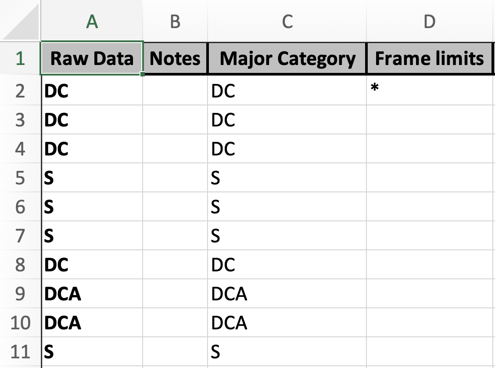
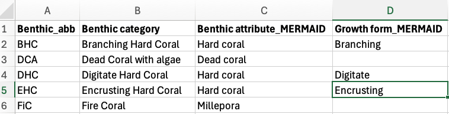
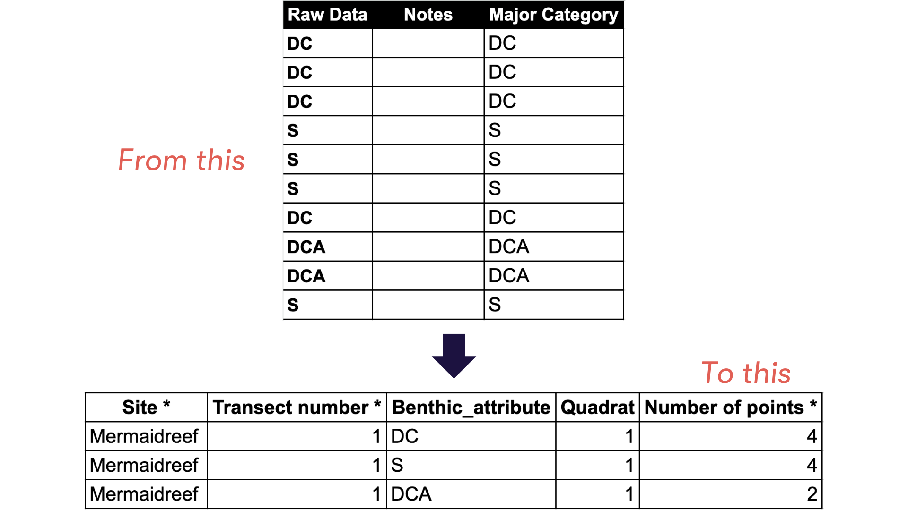

Photo quadrat transect (PQT) is one of the methods generally used to understand benthic community conditions. Before artificial intelligence emerged, scientists used Coral Point Count with Excel extensions (CPCe) to annotate their PQT. Once annotated, they continue with perform analysis to calculate the average cover of each benthic category. The first analysis steps is data cleaning. Data cleaning is one of the steps in analysis that takes most of the time. Data cleaning is a QA/QC process that is performed before analysing the data to ensure the results are scientifically reliable. MERMAID exist to help scientists and non-scientists cut the cleaning process and calculate the average benthic covers to quickly inform communities and governments.

You can import your CPCe data to MERMAID using our MERMAID R package mermaidr following our example below. You can also use our example data or use your own data to follow the importing steps. More information on the workflow of importing historical data to MERMAID can be found in our [Importing Data into MERMAID](https://datamermaid.org/documentation/importing-data) documentation.

## Steps to import your CPCe data are:

1.  [Prepare your project](https://datamermaid.org/documentation/setting-up-a-new-project) in [MERMAID Collect](https://app.datamermaid.org) and ensure that you are an [**admin**]{.underline} of the project

2.  Prepare your CPCe raw data and a benthic attribute converter file in a CSV format

3.  Install and activate mermaidr and other related packages

4.  Download the MERMAID PQT template

5.  Import your data to MERMAID

6.  Validate and submit in MERMAID Collect

## Step 1. Prepare your project in MERMAID Collect

Before importing your CPCe data to MERMAID, you need to set up your project in [MERMAID Collect](https://app.datamermaid.org). If you are new to MERMAID, you need to create a MERMAID account before using it. You can use a new project or existing project in MERMAID Collect as long as you are an admin of the project. [Setting up a new project](https://datamermaid.org/documentation/setting-up-a-new-project) requires internet access. To create a new project, click on the "New Project" button and then:

1.  add organization(s),
2.  add users,
3.  set data sharing permissions,
4.  add sites, and
5.  add management regimes.

## Step 2. Prepare your CPCe raw data and benthic attribute converter file in a CSV format

### Prepare your CPCe raw data

After you are done annotating your data with CPCe, export it. In the xls exported file, you will normally have a sheet that consist of four columns, i.e. Raw Data, Notes, Major Category, Frame limits (the image below). If you have more than one transect in an xls file, you will need to save each transect separately as a CSV file.



### Prepare the benthic attribute converter file

The benthic attribute converter file is a CSV file that contains your benthic labels and assign them to the correct MERMAID benthic attribute and/or growth forms. This file will be used to convert your labels to match the benthic attributes and/or growth forms accepted by MERMAID. You will only need to do this once then use this file every time you want to import your CPCe data to MERMAID. The file consists of four columns, i.e., **Benthic_abb** (*your benthic labels*), Benthic category (*what your benthic labels stand for*), **Benthic attribute_MERMAID** (*what MERMAID benthic attribute it corresponds to*), and **Growth form_MERMAID** (*what MERMAID growth form it corresponds to. This column can be left blank*).



## Step 3. Install and activate mermaidr and other related packages

After setting up your project in MERMAID Collect and preparing the necessary files, you can now start importing your data in R or R Studio. The first step is to install and activate the mermaidr and other related packages. In this example, we will be using `tidyverse` for data manipulation. Use the code below to install packages, if needed, and then load them in.


``` r
# install.packages("tidyverse")
# remotes::install_github("data-mermaid/mermaidr")

library(mermaidr)
library(tidyverse)
```

## Step 4. Download the MERMAID PQT template

Next step is to download the MERMAID Photo Quadrat Transect (PQT) template. We recommend using [RStudio projects](https://support.posit.co/hc/en-us/articles/200526207-Using-RStudio-Projects) to keep track of where your code, existing data, and any data you save (including the MERMAID PQT template) are.

To download the MERMAID PQT template, you will need to select your prepared project from the list of projects that `mermaidr` gathered by filtering using the `mermaid_get_my_projects( )` function from `mermaidr`. If you're using a test project, make sure to specify it by adding `include_test_project = TRUE`. Then download the template using the `mermaid_import_get_template_and_options( )` function.

1: Get your MERMAID project.


``` r
projects <- mermaid_get_my_projects()
```

2: Filter to select just the project you are working on


``` r
myproject <- projects %>%
  filter(name == "MERMAID Reef Surveys (training only)")
```

3: Get the import template and options


``` r
pqt_template <- mermaid_import_get_template_and_options(
  myproject,
  "benthicpqt",
  "benthicpqt_mermaidsurvey_template.xlsx"
)
```

```
## ✔ Import template and field options written to
## benthicpqt_mermaidsurvey_template.xlsx
```

Before running the code above, make sure that you change the project name **MERMAID Reef Surveys (training only)** in **2** to your actual project that you want to import your data into. Remember that **you need to be an admin** of the project to be able to access and import your data.

## Step 5. Prepare and reformat your data to match the MERMAID template

After downloading the MERMAID PQT template, you can start preparing and reformatting your data to match the template. Matching means that your data has the same column name and options accepted by the MERMAID template. Start by loading your data and the benthic attribute converter file. In this example, we will be loading all three transects from one site, combining it, and then reformat it all together.


``` r
raw_t1 <- read_csv2("Mermaidreef_T1.csv")
raw_t2 <- read_csv2("Mermaidreef_T2.csv")
raw_t3 <- read_csv2("Mermaidreef_T3.csv")
ba_conv <- read_csv2("BA_converter.csv")
```

If you are using a comma (",") to separate each data, use read_csv() instead of read_csv2(). This depends on your computer settings.

After loading the data, continue with cleaning the data. In this example, the cleaning data steps are:

1. Remove blank rows,

2 Subset only the `Raw Data` column and rename it to `Benthic_attribute`,

3. Add necessary columns for each transect, i.e., `Site *` and `Transect number *` (the column names match the MERMAID template), and

4. Combine the three transects.


``` r
# 1. Remove blank rows
pqt_t1 <- raw_t1 %>%
  filter(!is.na(`Raw Data`))

# 2. Rename the "Raw Data" column to "Benthic_attribute"
pqt_t1 <- pqt_t1 %>%
  rename(Benthic_attribute = `Raw Data`)

# 3. Add necessary columns, i.e., "Site *" and "Transect number *"
pqt_t1 <- pqt_t1 %>%
  mutate(
    `Site *` = "1206",
    `Transect number *` = 1,
    .before = "Benthic_attribute"
  )

# Repeat steps 1 - 3 for transect 2 and 3
pqt_t2 <- raw_t2 %>%
  filter(!is.na(`Raw Data`))
pqt_t2 <- pqt_t2 %>%
  rename(Benthic_attribute = `Raw Data`)
pqt_t2 <- pqt_t2 %>%
  mutate(
    `Site *` = "1206",
    `Transect number *` = 2,
    .before = "Benthic_attribute"
  )

pqt_t3 <- raw_t3 %>%
  filter(!is.na(`Raw Data`))
pqt_t3 <- pqt_t3 %>%
  rename(Benthic_attribute = `Raw Data`)
pqt_t3 <- pqt_t3 %>%
  mutate(
    `Site *` = "1206",
    `Transect number *` = 3,
    .before = "Benthic_attribute"
  )

# 5. Combine the three transects
pqt <- bind_rows(pqt_t1, pqt_t2, pqt_t3)

pqt
```

```
## # A tibble: 90 × 6
##    `Site *` `Transect number *` Benthic_attribute Notes `Major Category`
##    <chr>                  <dbl> <chr>             <lgl> <chr>           
##  1 1206                       1 DC                NA    Substrate       
##  2 1206                       1 DC                NA    Substrate       
##  3 1206                       1 DC                NA    Substrate       
##  4 1206                       1 S                 NA    Substrate       
##  5 1206                       1 S                 NA    Substrate       
##  6 1206                       1 S                 NA    Substrate       
##  7 1206                       1 DC                NA    Substrate       
##  8 1206                       1 CCA               NA    CCA             
##  9 1206                       1 CCA               NA    CCA             
## 10 1206                       1 S                 NA    Substrate       
## # ℹ 80 more rows
## # ℹ 1 more variable: `Frame limits` <chr>
```

Now that you have all the three transects combined, you can continue adding the rest of the mandatory columns. Mandatory columns are marked with an asterisk (*) next to the column name. You've added two mandatory columns to your data in the previous steps, which are `Site *` and `Transect number *`.

The next mandatory column that you are going to add is the quadrat numbers for each row based on the number of points you used per quadrat in your method. This example is using 10 points per quadrat. The quadrat numbers are assigned using the code below.

We add the quadrat number column by assigning the same number every 10 rows, where it increases every 10 rows and restart from 1 when a value in the column `Site *` and `Transect number *` changes. If you are using a different number of points per quadrat, simply replace "10" in the code with the actual number of points you are using in your method.


``` r
pqt <- pqt %>%
  group_by(`Site *`, `Transect number *`) %>%
  mutate(`Quadrat *` = rep(1:(ceiling(n() / 10)), each = 10)[1:n()]) %>%
  ungroup()
```

In the MERMAID PQT template, you will find "Number of points *" column. This column must be filled with the total number of points for the same benthic attribute per quadrat. CPCe provides data per point, meaning one point for one row, so you might have the same benthic attribute in multiple rows for one quadrat. This will be detected as a duplicate by MERMAID. Therefore, you need to combine the same benthic attribute for the same quadrat (see figure below).



Use the code below to calculate the number of points per benthic attribute for each quadrat:


``` r
pqt <- pqt %>%
  group_by(`Site *`, `Transect number *`, `Quadrat *`, Benthic_attribute) %>%
  dplyr::summarise(
    `Number of points *` = n(),
    .groups = "drop"
  )
```

Now you are ready to add the rest of the mandatory columns to your data. The remaining mandatory columns are **management regime** (`Management *`), **sampling date** (`Sample date: Year *`, `Sample date: Month *`, `Sample date: Day *`), **depth** (`Depth *`), **transect length** (`Transect length surveyed *`), **number of quadrats** (`Number of quadrats *`), **quadrat size** (`Quadrat size *`), **number of points per quadrat** (`Number of points per quadrat *`), **observer's email(s)** (`Observer emails *`), and **benthic attribute** (`Benthic attribute *`). You are going to also add one optional column, which is **growth form** (`Growth from`) as the data also recorded this information.

You are going to use the **benthic converter attribute** file to add the **benthic attribute** and **growth form** column. The code will match the label you used in your data with the label in the benthic attribute converter file, then return with the benthic attribute and/or growth form that are accepted by MERMAID.


``` r
pqt <- pqt %>%
  mutate(
    `Management *` = "Core Zone",
    `Sample date: Year *` = 2020,
    `Sample date: Month *` = 10,
    `Sample date: Day *` = 21,
    `Depth *` = 10,
    .before = "Transect number *"
  ) %>%
  mutate(
    `Transect length surveyed *` = 50,
    `Number of quadrats *` = 3,
    `Quadrat size *` = 0.5 * 0.5,
    `Number of points per quadrat *` = 10,
    `Observer emails *` = "amkieltiela@datamermaid.org",
    .before = "Quadrat *"
  )

pqt <- pqt %>%
  left_join(
    ba_conv %>%
      select(Benthic_abb,
        `Benthic attribute *` = `Benthic attribute_MERMAID`,
        `Growth form` = `Growth form_MERMAID`
      ),
    by = c("Benthic_attribute" = "Benthic_abb")
  ) %>%
  relocate(`Benthic attribute *`, `Growth form`, .after = "Quadrat *")

pqt
```

```
## # A tibble: 41 × 17
##    `Site *` `Management *` `Sample date: Year *` `Sample date: Month *`
##    <chr>    <chr>                          <dbl>                  <dbl>
##  1 1206     Core Zone                       2020                     10
##  2 1206     Core Zone                       2020                     10
##  3 1206     Core Zone                       2020                     10
##  4 1206     Core Zone                       2020                     10
##  5 1206     Core Zone                       2020                     10
##  6 1206     Core Zone                       2020                     10
##  7 1206     Core Zone                       2020                     10
##  8 1206     Core Zone                       2020                     10
##  9 1206     Core Zone                       2020                     10
## 10 1206     Core Zone                       2020                     10
## # ℹ 31 more rows
## # ℹ 13 more variables: `Sample date: Day *` <dbl>, `Depth *` <dbl>,
## #   `Transect number *` <dbl>, `Transect length surveyed *` <dbl>,
## #   `Number of quadrats *` <dbl>, `Quadrat size *` <dbl>,
## #   `Number of points per quadrat *` <dbl>, `Observer emails *` <chr>,
## #   `Quadrat *` <int>, `Benthic attribute *` <chr>, `Growth form` <chr>,
## #   Benthic_attribute <chr>, `Number of points *` <int>
```

After assigning each label to the accepted benthic attributes and/or growth forms, you can now remove the benthic attribute column that has your labels from the data frame using the code below:


``` r
pqt <- pqt %>%
  select(-Benthic_attribute)
```

## Step 6. Import your data to MERMAID

Your data now matches the MERMAID template and is ready to be imported to your project in MERMAID Collect. The steps to import your data are:

1. Validate your data to what you've set up in your project and options that MERMAID accepts. This is reflected in the MERMAID PQT template that you've downloaded

2. Address issues, if any

3. Recheck the data one more time by doing a dry run

4. Import your data to MERMAID

**Validate your data** using the `mermaid_import_check_options()` function for each column. This function will compare your data with the MERMAID PQT template you've downloaded, which is based on what you have set up in the project. If the data matches, a check mark will appear. If there's an issue, MERMAID will mark the issue with a **FALSE** note under the "match" column and provide the closest choice to help us address the issue(s). Issues must be addressed to be able to upload the data, except for non-mandatory fields. **Non-mandatory fields can be left blank or removed entirely from the data frame**. For example, in this example, you will find blank growth form(s), because not all benthic attributes have growth forms. Although you received a red dot and a message saying, "some errors in values of 'Growth form' - please check table below," it is okay to leave it as is. You can still import your data to MERMAID.


``` r
mermaid_import_check_options(pqt, pqt_template, "Site *")
```

```
## ✔ All values of `Site *` match
```

```
## # A tibble: 1 × 3
##   data_value closest_choice match
##   <chr>      <chr>          <lgl>
## 1 1206       1206           TRUE
```

``` r
mermaid_import_check_options(pqt, pqt_template, "Management *")
```

```
## ✔ All values of `Management *` match
```

```
## # A tibble: 1 × 3
##   data_value closest_choice match
##   <chr>      <chr>          <lgl>
## 1 Core Zone  core zone      TRUE
```

``` r
mermaid_import_check_options(pqt, pqt_template, "Sample date: Year *")
```

```
## ✔ Any value is allowed for `Sample date: Year *` - no checking to be done
```

``` r
mermaid_import_check_options(pqt, pqt_template, "Sample date: Month *")
```

```
## ✔ Any value is allowed for `Sample date: Month *` - no checking to be done
```

``` r
mermaid_import_check_options(pqt, pqt_template, "Sample date: Day *")
```

```
## ✔ Any value is allowed for `Sample date: Day *` - no checking to be done
```

``` r
mermaid_import_check_options(pqt, pqt_template, "Depth *")
```

```
## ✔ Any value is allowed for `Depth *` - no checking to be done
```

``` r
mermaid_import_check_options(pqt, pqt_template, "Transect number *")
```

```
## ✔ Any value is allowed for `Transect number *` - no checking to be done
```

``` r
mermaid_import_check_options(pqt, pqt_template, "Transect length surveyed *")
```

```
## ✔ Any value is allowed for `Transect length surveyed *` - no checking to be done
```

``` r
mermaid_import_check_options(pqt, pqt_template, "Number of quadrats *")
```

```
## ✔ Any value is allowed for `Number of quadrats *` - no checking to be done
```

``` r
mermaid_import_check_options(pqt, pqt_template, "Quadrat size *")
```

```
## ✔ Any value is allowed for `Quadrat size *` - no checking to be done
```

``` r
mermaid_import_check_options(pqt, pqt_template, "Number of points per quadrat *")
```

```
## ✔ Any value is allowed for `Number of points per quadrat *` - no checking to be done
```

``` r
mermaid_import_check_options(pqt, pqt_template, "Observer emails *")
```

```
## ✔ All values of `Observer emails *` match
```

```
## # A tibble: 1 × 3
##   data_value                  closest_choice              match
##   <chr>                       <chr>                       <lgl>
## 1 amkieltiela@datamermaid.org amkieltiela@datamermaid.org TRUE
```

``` r
mermaid_import_check_options(pqt, pqt_template, "Quadrat *")
```

```
## ✔ Any value is allowed for `Quadrat *` - no checking to be done
```

``` r
mermaid_import_check_options(pqt, pqt_template, "Benthic attribute *")
```

```
## ✔ All values of `Benthic attribute *` match
```

```
## # A tibble: 14 × 3
##    data_value               closest_choice           match
##    <chr>                    <chr>                    <lgl>
##  1 Crustose coralline algae crustose coralline algae TRUE 
##  2 Dead coral               dead coral               TRUE 
##  3 Sand                     sand                     TRUE 
##  4 Acropora                 acropora                 TRUE 
##  5 Hard coral               hard coral               TRUE 
##  6 Rock                     rock                     TRUE 
##  7 Macroalgae               macroalgae               TRUE 
##  8 Rubble                   rubble                   TRUE 
##  9 Soft coral               soft coral               TRUE 
## 10 Millepora                millepora                TRUE 
## 11 Other invertebrates      other invertebrates      TRUE 
## 12 Sponge                   sponge                   TRUE 
## 13 Turf algae               turf algae               TRUE 
## 14 Heliopora                heliopora                TRUE
```

``` r
mermaid_import_check_options(pqt, pqt_template, "Growth form")
```

```
## ✔ All values of `Growth form` match
```

```
## # A tibble: 7 × 3
##   data_value     closest_choice match
##   <chr>          <chr>          <lgl>
## 1 Branching      branching      TRUE 
## 2 Encrusting     encrusting     TRUE 
## 3 Foliose        foliose        TRUE 
## 4 Massive        massive        TRUE 
## 5 Digitate       digitate       TRUE 
## 6 Mushroom coral mushroom coral TRUE 
## 7 Submassive     submassive     TRUE
```

``` r
mermaid_import_check_options(pqt, pqt_template, "Number of points *")
```

```
## ✔ Any value is allowed for `Number of points *` - no checking to be done
```

After addressing all the issues, you can save the clean data as a CSV file using the code below:


``` r
write_csv(pqt, "pqt_mermaidreef.csv")
```

After validating and addressing all the issues, you need to perform a dry run check one last time using the `mermaid_import_project_data()` function and set `dryrun = TRUE`.


``` r
mermaid_import_project_data(
  pqt,
  myproject,
  method = "benthicpqt",
  dryrun = TRUE
)
```

```
## Records successfully checked! To import, please run the function again with `dryrun = FALSE`.
```

Once you get the message **Records successfully checked!**, change the dryrun option to FALSE to start importing your data to MERMAID.


``` r
mermaid_import_project_data(
  pqt,
  myproject,
  method = "benthicpqt",
  dryrun = FALSE
)
```

```
## Records successfully imported! Please review in Collect.
```

## Step 7. Validate and submit your data in MERMAID Collect

After you get the message **Record successfully imported! Please review in Collect**, head to your Collecting Page in your project in the MERMAID Collect. Continue with validating and submitting each transect.

**Congratulations! You have successfully imported your CPCe data to MERMAID!**
